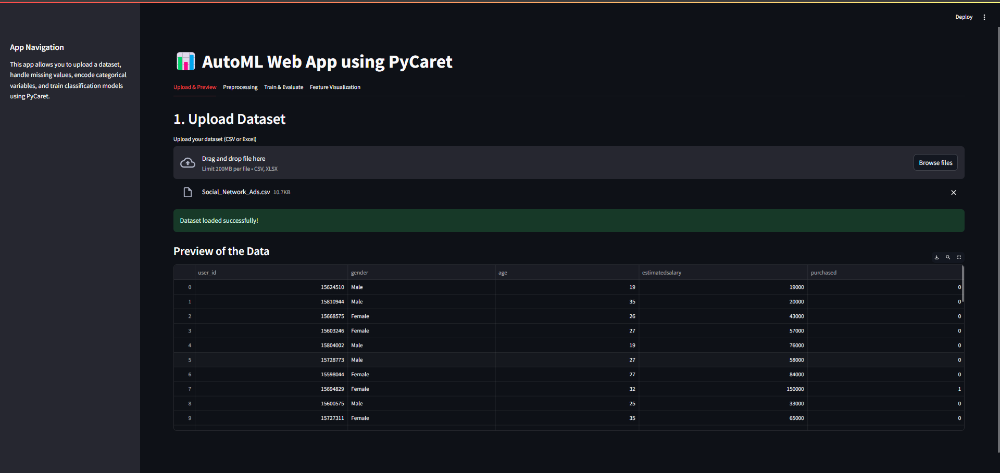
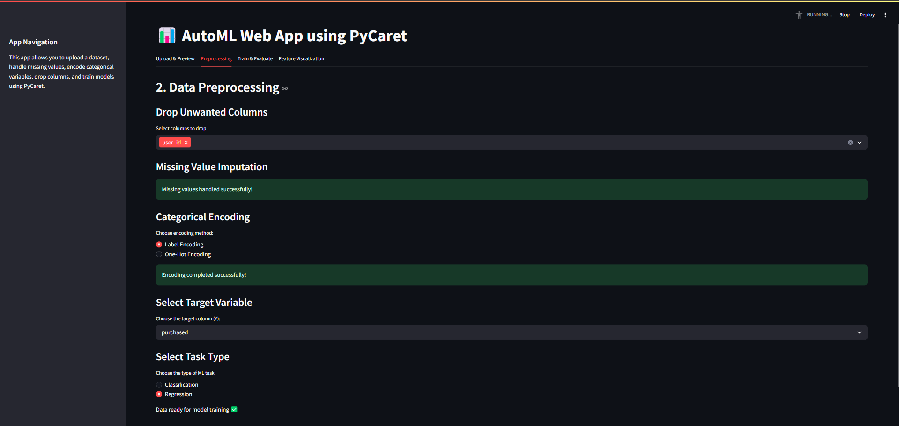
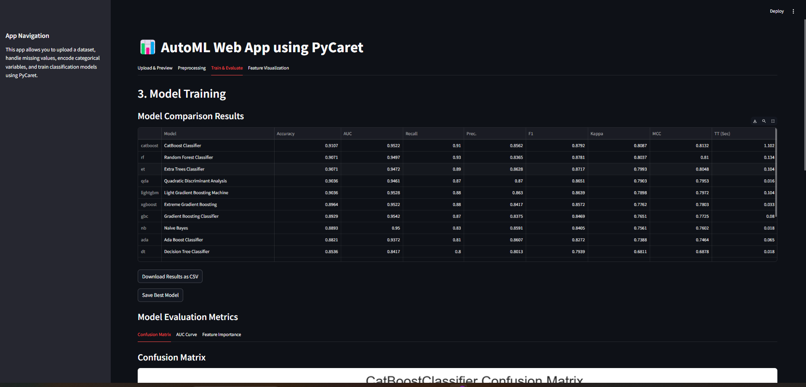
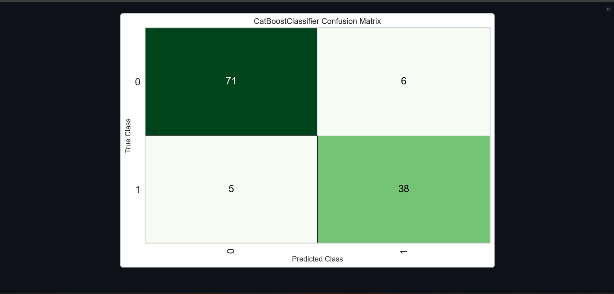
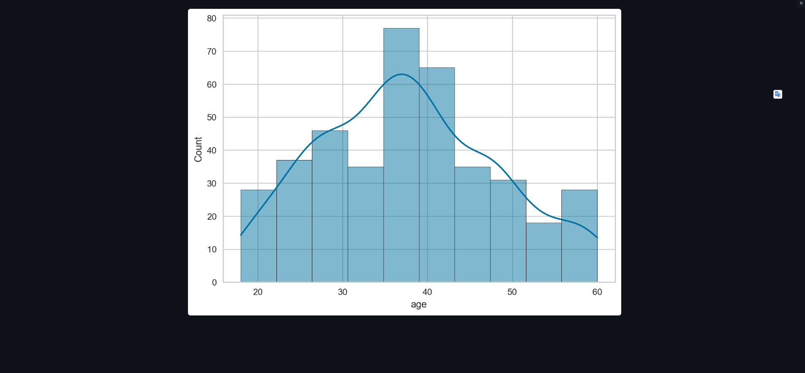

# ⚡ AutoML Streamlit App using PyCaret

A no-code machine learning web app built using **PyCaret** and **Streamlit**.  
It allows you to upload a dataset, preprocess it, select the task type (Classification or Regression), train models automatically, and visualize the results — all in a few clicks!

---

## 🌟 Features

- 📁 Upload CSV or Excel datasets
- 🧹 Handle missing values automatically
- 🧯 Drop unwanted columns
- 🔤 Encode categorical variables
- 🎯 Select target column
- ⚡ Choose task type: **Classification** or **Regression**
- ⚙️ Train and compare multiple models using PyCaret
- 📈 View performance metrics:
  - Confusion Matrix (for classification)
  - AUC-ROC Curve (for classification)
  - Feature Importance
- 💾 Download model comparison results
- ✅ Save the best-performing model as `.pkl`

---

## 🖼️ App Walkthrough

### 1. Upload & Preview Data  
  
*Upload your dataset and preview the data.*

### 2. Preprocessing  
  
*Drop columns, handle missing values, encode categorical variables, and select the task type and target variable.*

### 3. Model Training  
  
*Train and compare models using PyCaret.*

### 4. Evaluation Metrics  
  
*View evaluation metrics based on the selected task type.*

### 5. Feature Visualization  
  
*Visualize feature distributions to gain insights.*

---

## 🌐 Live Demo

Try the app online (note: performance may vary):  
🔗 [Streamlit Cloud App](https://automl-app-pycaret-app-zoeaujxozfb4pj746sugrk.streamlit.app/)

---

## ⚠️ Performance Note

Due to limited resources on **Streamlit Cloud**, training may be **slow or timeout** for large datasets.

💡 **Recommended:**  
Clone the repository and run the app locally in your virtual environment for optimal performance.

---

## 🛠 Tech Stack

- Python 3.10+
- PyCaret 3.0.4
- Streamlit 1.28+
- Pandas, Scikit-learn, Matplotlib, Seaborn

---

## 🚀 Run Locally

```bash
# Clone the repository
git clone https://github.com/yourusername/automl-streamlit-pycaret-app.git
cd automl-streamlit-pycaret-app

# Create and activate virtual environment
python -m venv venv
source venv/bin/activate   # On Windows use: venv\Scripts\activate

# Install requirements
pip install -r requirements.txt

# Run the app
streamlit run streamlit_app.py
